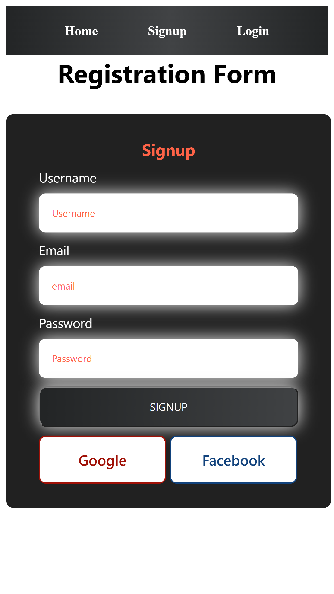
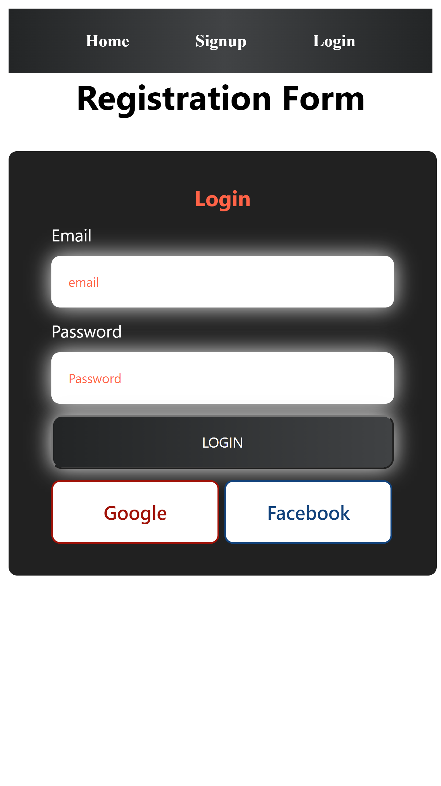

# Registration Form

Welcome to the Registration Form.
visit : https://regis-form-one.vercel.app/

## Table of Contents

- [About](#about)
- [Features](#features)
- [Getting Started](#getting-started)
- [Usage](#usage)
- [Technologies Used](#technologies-used)
- [Deployment](#deployment)
- [Contributing](#contributing)
- [License](#license)

## About

Registration is a assignment for the user signup

## Features

-
- Registration handle through Local storage
- user is able to registered
- user is able to login
- user is able to navigate to home page after login.

## Screenshots

## Deployment

Deployed Link: https://regis-form-one.vercel.app/

## Getting Started

# Clone the repository

[git clone https://github.com/mohdadil12345/Zarektronix](https://github.com/mohdadil12345/Registration_form)

# Change directory

cd your-repo

# Install dependencies

npm install

# Start the development server

ng serve --open

## Technologies Used

- Registration from   is built using the following technologies:

- Angular
- css
- node
- typescript
- vercel

## Usage

- Visit the application in your web browser at the URL https://regis-form-one.vercel.app/
